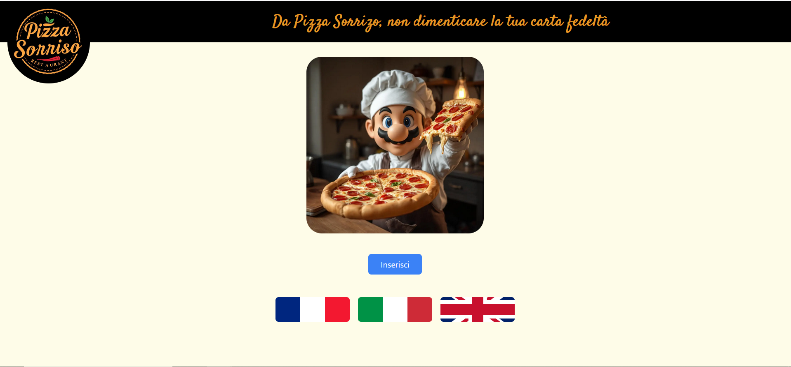
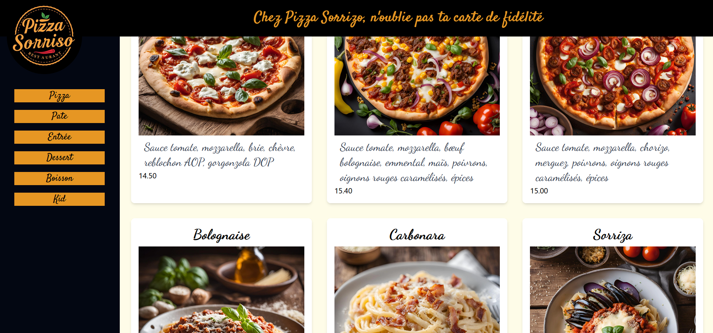
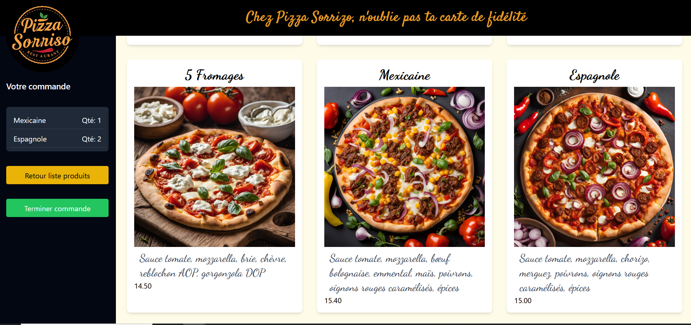
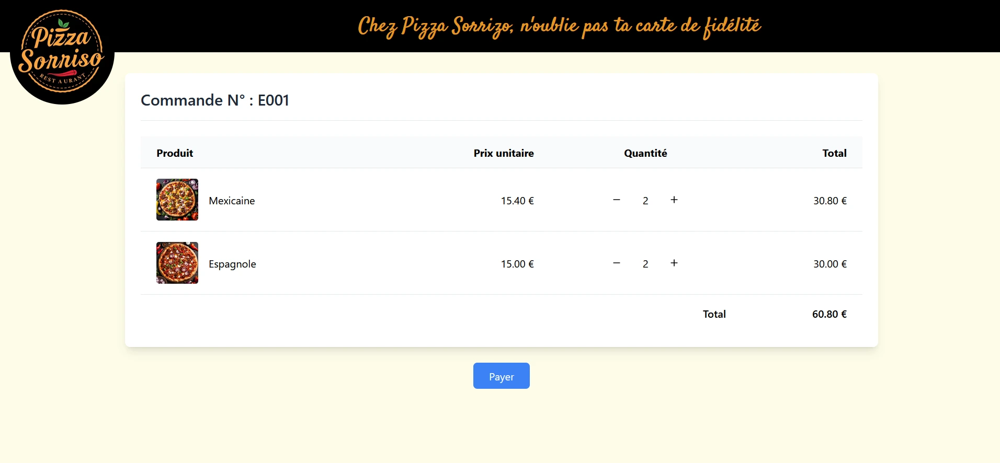
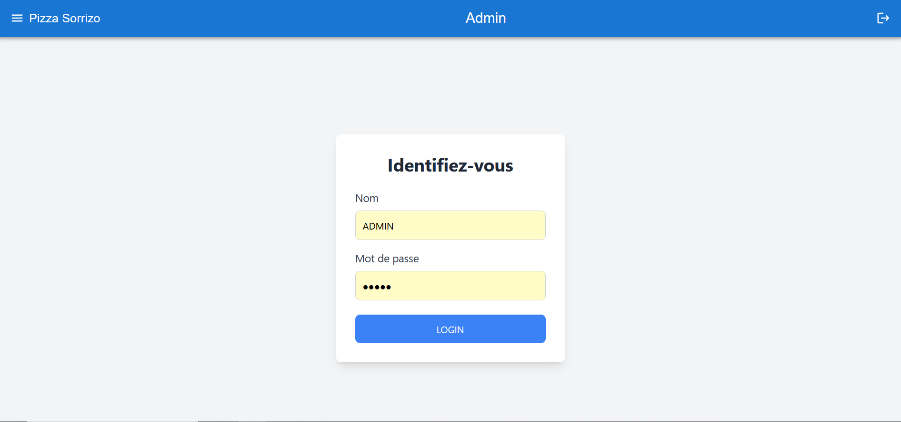
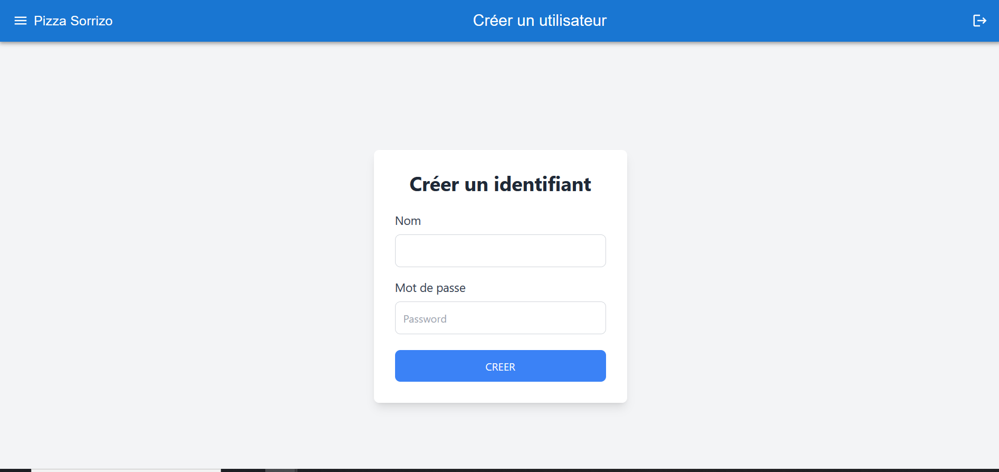
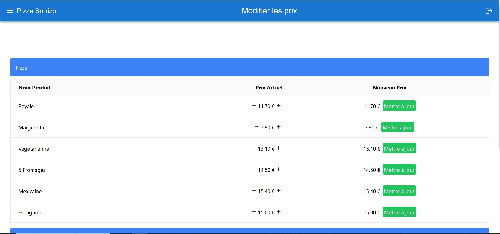
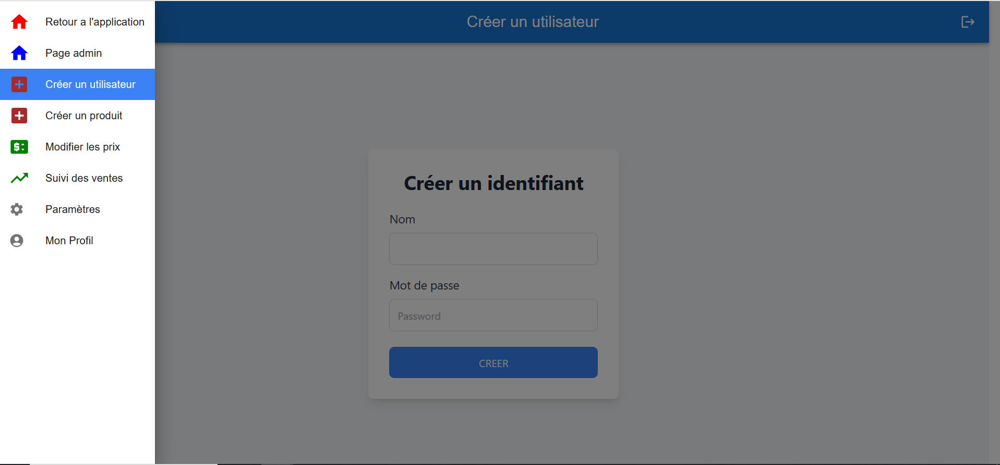
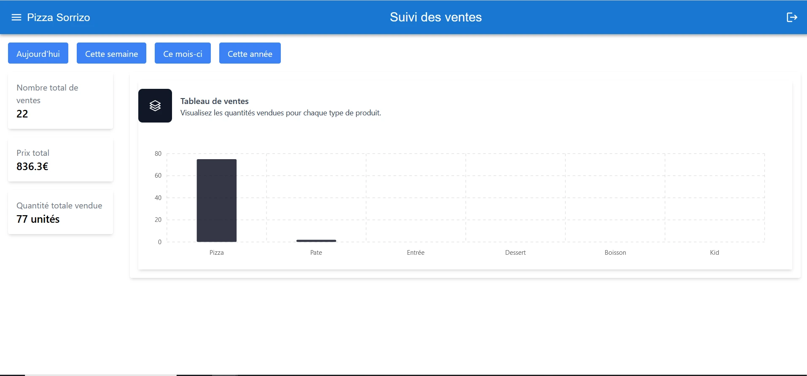
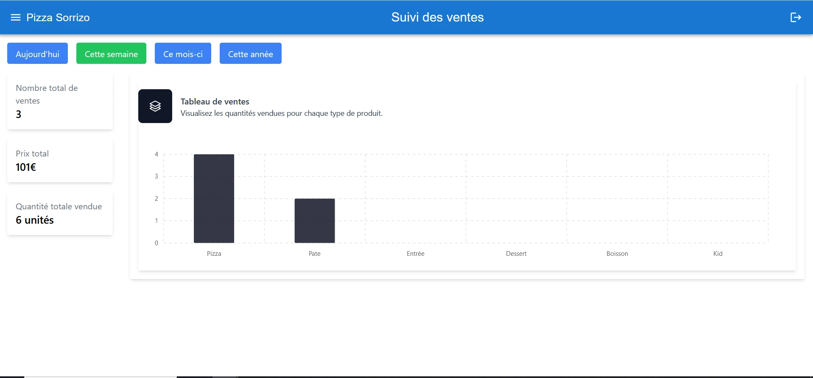

#pizza sorrizo
## La partie user
L'acceuil avec choix de langue

Le menu commande avec possibilité de filtrer les produits

Lorsque l'on clique sur un produit switch des filtres a une visualisation de la commande et un double clic incremente

Enfin la validation de commande on l'on peut ajuster.

Le choix du paiement pourrait se faire en caisse ou via un TPA que je n'ai pas traité ici.

## La partie admin

Un systeme de connection que le backend peut bloquer en cas d'erreur

Simple la creation d'un compte admin qui permet surtout de simplifier l'enregistrement car le mot de passe est hashe dans la bdd

Creation d'un produit ou l'image est enregistée dans le backend avec un selection de dossier(multer)

Un prix peut evoluer et me sert aussi pour l'historique

La naviguation de la partie admin

Enfin le suivi des ventes 

